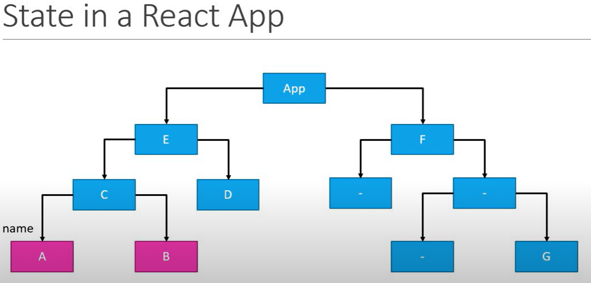
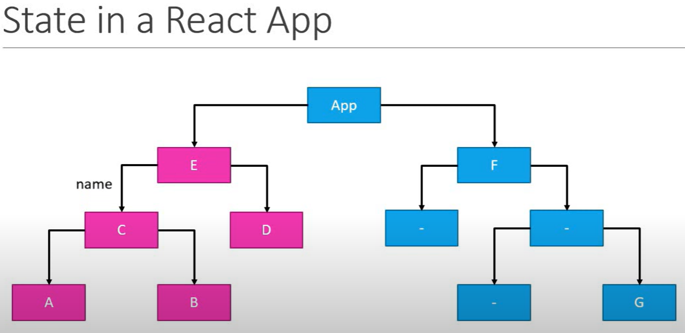
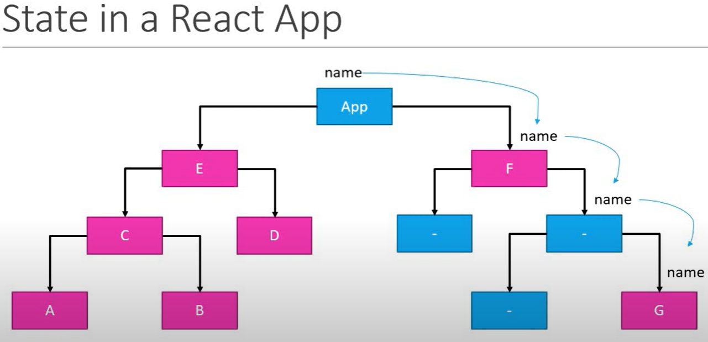
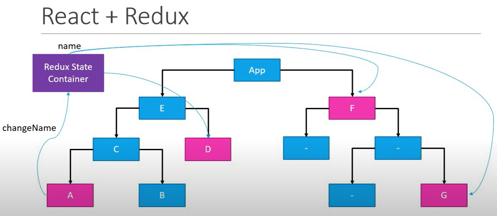
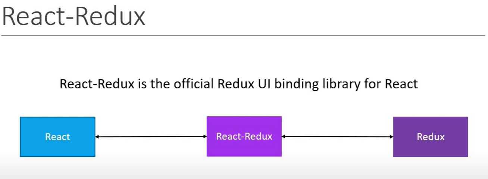
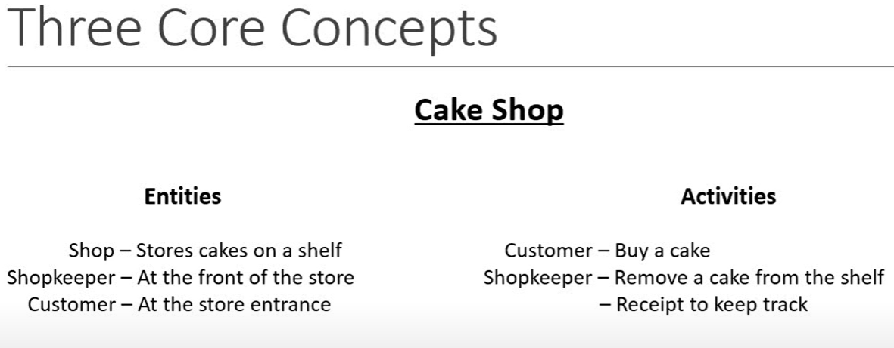
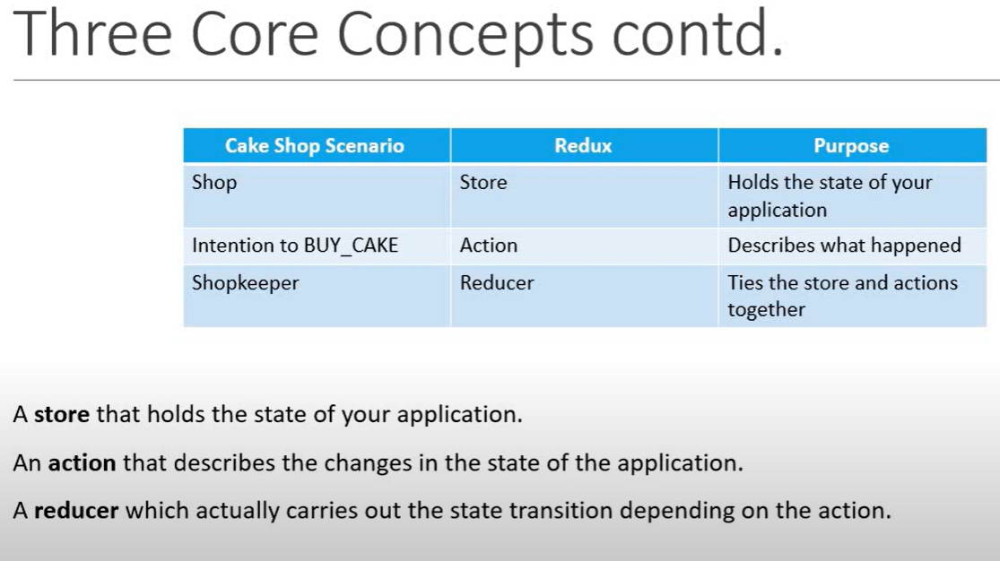

# react_redux_vishwas_course

<!-- Introduction lecture 1 -->

## lecture 1 Redux

- Redux is a library
- Redux is a `predictable`,`state container` for `Javascript apps`
- so it has three parts
  1. It is for JavaScript apps
  2. It is a state container
  3. It is predictable

### 1. Redux is for JavaScript applications

- Redux is not tied to React
- can be used with React, Angular, Vue or even with vanilla Javascript
- so Redux is a library for javascript applications

### 2. Redux is a state container

- Redux stores the state of your application
- consider in a react app `state of a component` can be for example

```
//LoginFormComponent
state = {
  username: '',
  password: '',
  submitting: false
}

// UserListComponent
state = {
  users: []
}
```

- so state of an application is the state representated by all the individual components of that app (`this includes the data and the UI logic`)
- so in a typical application we have all the components state as below

```
// Application

state = {
  isUserLoggedIn: true,
  username: 'vishwas',
  profileUrl: '',
  onlineUsers: [],
  isModalOpened: false
}
```

### 3. Redux is predictable

- predictable in what way?
- redux is a state container
- the state of the application can change
- for example: todo list app item state can change from `pending` to `completed`
- so in redux, all state transitions are explicit and it is possible to keep track of them
- so the changes to your application's state become predictable

## React + Redux

- why would we want to use redux in a react application?
- components in react have their own state
- why do we need another tool to help manage that state?





- so from the above picture we can see if many components are sharing the same state. state managment become cumbersum. lifting the state every time and drilling the state through props is very hectic
- with redux state management is easy. in redux all the states are stored in a container. which we can than forward to the only components which needs it. as seen in picture



### Do we really have a problem?

- as react context is preventing prop drilling
- useContext + useReducer in combination can do this job
- As Redux 1.0 was developed in August 2015. that time we don't have useContext and useReducer

## React-Redux library

- React-Redux is the official Redux UI binding library for React
- React and Redux are separate things
- React is UI library
- Redux is state managment library
- React-Redux library is combining both. a picture for understandin.



## Course Structure

- First we will learn just the Redux library
- than we will learn React-Redux in this course

<!-- lecture 2 Getting started -->

## lecture 2 Getting Started

1. install node
2. install npm
3. run the command in the root folder. it will create a `package.json` file

```
npm init --yes
```

4. again run another command

```
npm install redux
```

5. create a file `index.js` with below code

```
console.log('From index.js')
```

6. in terminal `node index.js`. it will console log the message

## lecture 3 Three Core Concepts

- A scenario with an example from the picture
  

- in relation to Redux the scenario can be picture as below
  
