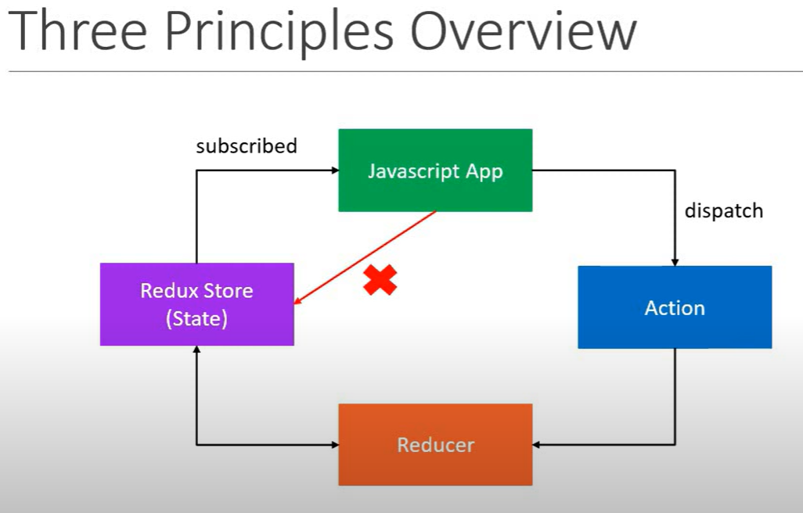

# react_redux_vishwas_course

<!-- Introduction lecture 1 -->

## lecture 1 Redux

- Redux is a library
- Redux is a `predictable`,`state container` for `Javascript apps`
- so it has three parts
  1. It is for JavaScript apps
  2. It is a state container
  3. It is predictable

### 1. Redux is for JavaScript applications

- Redux is not tied to React
- can be used with React, Angular, Vue or even with vanilla Javascript
- so Redux is a library for javascript applications

### 2. Redux is a state container

- Redux stores the state of your application
- consider in a react app `state of a component` can be for example

```
//LoginFormComponent
state = {
  username: '',
  password: '',
  submitting: false
}

// UserListComponent
state = {
  users: []
}
```

- so state of an application is the state representated by all the individual components of that app (`this includes the data and the UI logic`)
- so in a typical application we have all the components state as below

```
// Application

state = {
  isUserLoggedIn: true,
  username: 'vishwas',
  profileUrl: '',
  onlineUsers: [],
  isModalOpened: false
}
```

### 3. Redux is predictable

- predictable in what way?
- redux is a state container
- the state of the application can change
- for example: todo list app item state can change from `pending` to `completed`
- so in redux, all state transitions are explicit and it is possible to keep track of them
- so the changes to your application's state become predictable

## React + Redux

- why would we want to use redux in a react application?
- components in react have their own state
- why do we need another tool to help manage that state?


- so from the above picture we can see if many components are sharing the same state. state managment become cumbersum. lifting the state every time and drilling the state through props is very hectic
- with redux state management is easy. in redux all the states are stored in a container. which we can than forward to the only components which needs it. as seen in picture


### Do we really have a problem?

- as react context is preventing prop drilling
- useContext + useReducer in combination can do this job
- As Redux 1.0 was developed in August 2015. that time we don't have useContext and useReducer

## React-Redux library

- React-Redux is the official Redux UI binding library for React
- React and Redux are separate things
- React is UI library
- Redux is state managment library
- React-Redux library is combining both. a picture for understandin.


## Course Structure

- First we will learn just the Redux library
- than we will learn React-Redux in this course

<!-- lecture 2 Getting started -->

## lecture 2 Getting Started

1. install node
2. install npm
3. run the command in the root folder. it will create a `package.json` file

```
npm init --yes
```

4. again run another command

```
npm install redux
```

5. create a file `index.js` with below code

```
console.log('From index.js')
```

6. in terminal `node index.js`. it will console log the message

## lecture 3 Three Core Concepts

- A scenario with an example from the picture
  

- in relation to Redux the scenario can be picture as below
  

## lecture 4 Three Principles

### First Principle

** The state of your whole application is stored in an object tree within a single store**

- in simple language we have to maintain our application state in a single object which would be managed by the Redux store.

- lets assume we are tracking the number of cakes on the shelf in a store our object will look something like

```
{
  numberOfCakes: 10
}
```

### Second Principle

** The only way to change the state is to emit an action, an object describing what happend **

- in simple terms to update the state of your app, you need to let Redux know about that with an `action`.
- we are not allowed to directly update the state object
  <u>Cake Shop Example</u>
  Let the shopkeeper know about your action - BUY_CAKE. to represent the action in code well it is a simple object witha a `type` property.

```
{
type: BUY_CAKE
}
```

- so the Second principle is that that a state is readonly thing which can only be change by emitting an action.

### Third Principle

** To specify how the state tree is transformed by actions, you write pure reducers **

- the second principle says that state can only be transformed only by emitting actions. but how should the state transforms the third principle says this
- we need to write pure reducers. pure reducers are basically the pure functions that take the previousState and action as input in function and returns a newState
- `Reducer - (previousState, action) => newState`
- The `Reducer` instead of updating the `old state` should produce a `newState`
  <u>Cake Shop Example</u>

Reducer is the shopkeeper. below is a reducer

```
const reducer = (state, action) => {
  switch (action.type){
    case BUY_CAKE: return {
      numOfCakes: state.numOfCakes -1
    }
  }
}
```

### Three Principles Overview

The 3 principles overview can be better depicted in a picture.



## lecture 5 Actions

- Actions are the only way our application can interact with the store
- Actions carry some information from the app to the redux store
- Actions are plain JavaScript objects
- Actions have a `type` property that indicates the type of action being performed
- The `type` property is typically defined as string constants

### Actions related code

1. first we define the `string constant` that defines the type of Action

```
const BUY_CAKE = 'BUY_CAKE'
```

this will avoid the spelling mistakes when we will be using the Actions. it is followed in the community

2. next define our Action. so remember an Action is an Object with a `property` of `type`.
3. and here that type property has a value `BUY_CAKE`
4. This is Action we just created

```
/* lecture 5 Actions */
const BUY_CAKE = 'BUY_CAKE'; // string constant

// below is action definition
{
  type: BUY_CAKE;
}
```

5. we are not restricted to provide only `type` property in an Action. other than type the structure of the Action object is completely upto us. we can add other properties to it.
6. so we can have other property that is an object or really simply property like a string which we use here as `info` and set it to 'First Redux action'

```
const BUY_CAKE = 'BUY_CAKE'; // string constant

// below is action definition
{
  type: BUY_CAKE;
  info: 'First redux action'
}
```

above we have action completed. but in Redux we can also have an `Action Creator`. 7. An `Action Creator` simply creates an Action. in terms of code an `Action Creator` is a function that returns an action. 8. so to implement the `Action Creator` function. we can write a function `buyCake()`

```
// Action Creator function implementation
const BUY_CAKE = 'BUY_CAKE'; // string constant

function buyCake() {
  return {
    type: BUY_CAKE,
    info: 'First redux action',
  };
}
```

## lecture 6 Reducers

- let us recollect what we know about Reducers.
- Reducers specify how the app's state changes in response to actions sent to the store.
- so `Actions` only specify what happend. but it didn't specify how the application state changes. `Reducers` are in charge of that.

<u>Reducer</u>

- Reducer is a function that accepts state and action as arguments, and returns the next state of the application

- in simple words we can say

```
Reducer = (previousState, action) => newState
```

- so as the Reducer accepts a state and the Redux need a state for the whole application (and the whole application state needs to be in a single object). we will create first an `initial state`. which in our case will be

```
const initialState = {
  numberOfCakes: 10
}
```

- This is a simple state of application. in complex application we can have a more complex state of the object.
- now we will define the `reducer` function down below

```
// Reducer is defined below
const reducer = (state = initialState, action) => {
  switch (action.type) {
    case BUY_CAKE:
      return {
        numberOfCakes: state.numberOfCakes - 1,
      };
    default:
      return state;
  }
};
```

- The initial value of the state is always pass as an initial state of the application to the Reducer function
- if the state object contains more than one property. than first spread the state and change only that property which needs to be changed. spreading the state object essentially means copying the state object

```
// if state object contain more than one property. than first we spread the state like below
const reducer = (state = initialState, action) => {
  switch (action.type) {
    case BUY_CAKE:
      return {...state,
        numberOfCakes: state.numberOfCakes - 1, // here we are not mutating the state object. we are returning a new object
      };
    default:
      return state;
  }
};
```

## lecture 7 Store

- let us learn about `store` which bring the `actions` and the `reducer` togather.
- we know only one thing about the `store` that for our entire application we have only just one store.

<u>Responsibilities of Store</u>

1. Holds application state
2. it exposes a method `getState()` which allows access to the application state
3. it provides a method called `dispatch(action)` that allows to update the state of the application. the dispatch(action) method accept an action as its parameter.
4. the `store` also allows the listeners to register via the `subscribe(listener)` method. The subscribe method accepts a function as a parameter which is executed anytime the `state` or the `redux store` changes.
5. finally you can unscribe to the function by calling the function that was returned by the `subscribed(listener)` method.

Now our goal is to implement all these in our application.

<u>1. Holds application state</u>

- if you have to use the `redux` in a react application. that use can use `redux` but writing like this

```
import redux from 'redux'
```

however we are running this app as a simple node.js application for which we have to use the `require` syntax.

```
const redux = require('redux')
```

The redux library provides a method called `createStore()` which we are going to use for creating the store.

```
const createStore = redux.createStore
const store = createStore()
```

- The `createStore()` function accepts a parameter which is the `reducer` function. the reducer function has the initial state of the applicaton. This is required for the store to make the state transition based on the action received.

<u>2. getState() method</u>

```
console.log(store.getState())
```

<u>4. subcribe to listener</u>

The fourth responsibility is to allow the app to subscribe to changes in the `store` that is acheived using the `subscribe` method. The `subscribe` method accepts a function. to keep our example simple we are going to log only the updated state.

```
store.subscribe(() =>
  console.log('updated state', store.getState())
);
```

<u>3. dispatch(action)</u>

- The source provide a `dispatch` method to `update the state`
- The dispatch method accepts an `action` as its parameter.
- so here we can either directly provide an `action`. but we have an `action creator` so we will use that.

```
store.dispatch(buyCake());
store.dispatch(buyCake());
store.dispatch(buyCake());
```

- we are doing it 3 times to see 3 state transitions

<u>5. unsubscribing </u>
the final part is to `unsubscribe` from the `store` by calling the function return by the `subscribe method`.

```
const unsubscribe = store.subscribe(() =>
  console.log('updated state', store.getState())

unsubscribe();
);
```

<u> output </u>

the output is as below

```
$ node index
initial state { numberOfCakes: 10 }
updated state { numberOfCakes: 9 }
updated state { numberOfCakes: 8 }
updated state { numberOfCakes: 7 }
```
